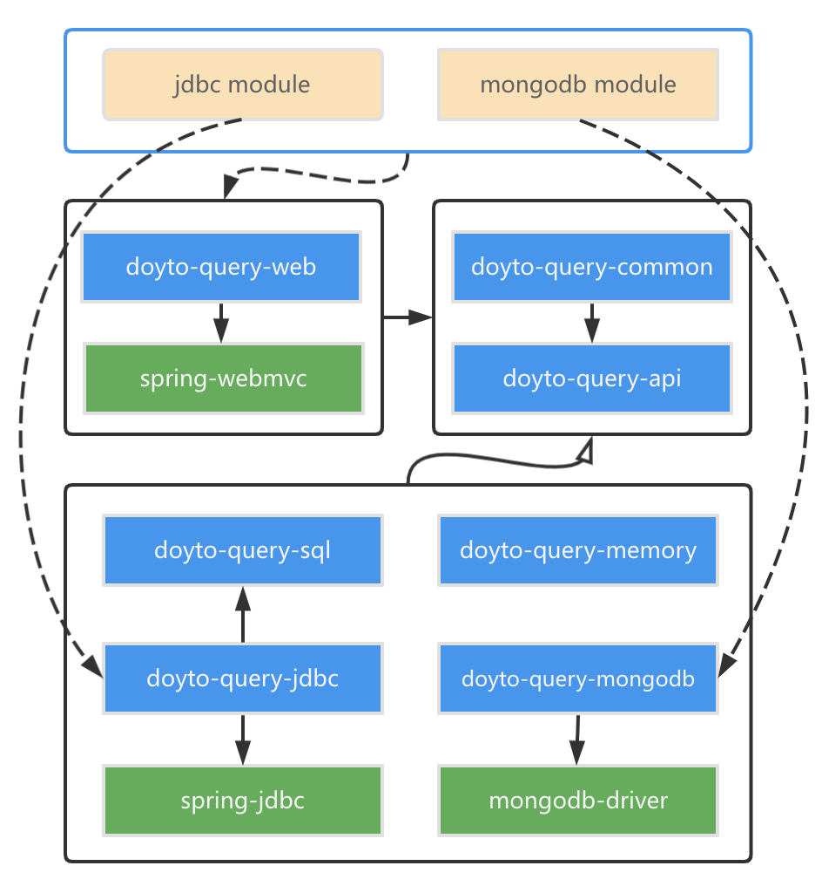

Repositories of DoytoWin 
---

## Versions

| Module | Snapshot | Release |
| --- | --- | --- |
| doyto-query-geo | [![geo-snapshots-img]](https://oss.sonatype.org/content/repositories/snapshots/win/doyto/doyto-query-geo/) | [![geo-release-img]](https://search.maven.org/artifact/win.doyto/doyto-query-geo/) |
| doyto-query-api | [![api-snapshots-img]](https://oss.sonatype.org/content/repositories/snapshots/win/doyto/doyto-query-api/) | [![api-release-img]](https://search.maven.org/artifact/win.doyto/doyto-query-api/) |
| doyto-query-common | [![common-snapshots-img]](https://oss.sonatype.org/content/repositories/snapshots/win/doyto/doyto-query-common/) | [![common-release-img]](https://search.maven.org/artifact/win.doyto/doyto-query-common/) |
| doyto-query-memory | [![memory-snapshots-img]](https://oss.sonatype.org/content/repositories/snapshots/win/doyto/doyto-query-memory/) | [![memory-release-img]](https://search.maven.org/artifact/win.doyto/doyto-query-memory/) |
| doyto-query-dialect | [![dialect-snapshots-img]](https://oss.sonatype.org/content/repositories/snapshots/win/doyto/doyto-query-dialect/) | [![dialect-release-img]](https://search.maven.org/artifact/win.doyto/doyto-query-dialect/) |
| doyto-query-sql | [![sql-snapshots-img]](https://oss.sonatype.org/content/repositories/snapshots/win/doyto/doyto-query-sql/) | [![sql-release-img]](https://search.maven.org/artifact/win.doyto/doyto-query-sql/) |
| doyto-query-jdbc | [![jdbc-snapshots-img]](https://oss.sonatype.org/content/repositories/snapshots/win/doyto/doyto-query-jdbc/) | [![jdbc-release-img]](https://search.maven.org/artifact/win.doyto/doyto-query-jdbc/) |
| doyto-query-mongodb | [![mongodb-snapshots-img]](https://oss.sonatype.org/content/repositories/snapshots/win/doyto/doyto-query-mongodb/) | [![mongodb-release-img]](https://search.maven.org/artifact/win.doyto/doyto-query-mongodb/) |
| doyto-query-web-common | [![web-common-snapshots-img]](https://oss.sonatype.org/content/repositories/snapshots/win/doyto/doyto-query-web-commoncommon/) | [![web-common-release-img]](https://search.maven.org/artifact/win.doyto/doyto-query-web-common/) |
| doyto-query-web | [![web-snapshots-img]](https://oss.sonatype.org/content/repositories/snapshots/win/doyto/doyto-query-web/) | [![web-release-img]](https://search.maven.org/artifact/win.doyto/doyto-query-web/) |
| _**Reactive versions**_ | | |
| doyto-query-reactive-api | [![reactive-api-snapshots-img]](https://oss.sonatype.org/content/repositories/snapshots/win/doyto/doyto-query-reactive-api/) | [![reactive-api-release-img]](https://search.maven.org/artifact/win.doyto/doyto-query-reactive-api/) |
| doyto-query-reactive-memory | [![reactive-memory-snapshots-img]](https://oss.sonatype.org/content/repositories/snapshots/win/doyto/doyto-query-reactive-memory/) | [![reactive-memory-release-img]](https://search.maven.org/artifact/win.doyto/doyto-query-reactive-memory/) |
| doyto-query-r2dbc | [![r2dbc-snapshots-img]](https://oss.sonatype.org/content/repositories/snapshots/win/doyto/doyto-query-r2dbc/) | [![r2dbc-release-img]](https://search.maven.org/artifact/win.doyto/doyto-query-r2dbc/) |
| doyto-query-reactive-mongodb | [![reactive-mongodb-snapshots-img]](https://oss.sonatype.org/content/repositories/snapshots/win/doyto/doyto-query-reactive-mongodb/) | [![reactive-mongodb-release-img]](https://search.maven.org/artifact/win.doyto/doyto-query-reactive-mongodb/) |
| doyto-query-webflux | [![webflux-snapshots-img]](https://oss.sonatype.org/content/repositories/snapshots/win/doyto/doyto-query-webflux/) | [![webflux-release-img]](https://search.maven.org/artifact/win.doyto/doyto-query-webflux/) |

Architecture
---

  
  

License
-------
This project is under the [Apache Licence v2](https://www.apache.org/licenses/LICENSE-2.0).

[geo-snapshots-img]: https://img.shields.io/nexus/s/win.doyto/doyto-query-geo?color=blue&server=https%3A%2F%2Foss.sonatype.org
[geo-release-img]: https://img.shields.io/maven-central/v/win.doyto/doyto-query-geo?color=brightgreen
[api-snapshots-img]: https://img.shields.io/nexus/s/win.doyto/doyto-query-api?color=blue&server=https%3A%2F%2Foss.sonatype.org
[api-release-img]: https://img.shields.io/maven-central/v/win.doyto/doyto-query-api?color=brightgreen
[common-snapshots-img]: https://img.shields.io/nexus/s/win.doyto/doyto-query-common?color=blue&server=https%3A%2F%2Foss.sonatype.org
[common-release-img]: https://img.shields.io/maven-central/v/win.doyto/doyto-query-common?color=brightgreen
[memory-snapshots-img]: https://img.shields.io/nexus/s/win.doyto/doyto-query-memory?color=blue&server=https%3A%2F%2Foss.sonatype.org
[memory-release-img]: https://img.shields.io/maven-central/v/win.doyto/doyto-query-memory?color=brightgreen
[sql-snapshots-img]: https://img.shields.io/nexus/s/win.doyto/doyto-query-sql?color=blue&server=https%3A%2F%2Foss.sonatype.org
[sql-release-img]: https://img.shields.io/maven-central/v/win.doyto/doyto-query-sql?color=brightgreen
[jdbc-snapshots-img]: https://img.shields.io/nexus/s/win.doyto/doyto-query-jdbc?color=blue&server=https%3A%2F%2Foss.sonatype.org
[jdbc-release-img]: https://img.shields.io/maven-central/v/win.doyto/doyto-query-jdbc?color=brightgreen
[mongodb-snapshots-img]: https://img.shields.io/nexus/s/win.doyto/doyto-query-mongodb?color=blue&server=https%3A%2F%2Foss.sonatype.org
[mongodb-release-img]: https://img.shields.io/maven-central/v/win.doyto/doyto-query-mongodb?color=brightgreen
[web-common-snapshots-img]: https://img.shields.io/nexus/s/win.doyto/doyto-query-web-common?color=blue&server=https%3A%2F%2Foss.sonatype.org
[web-common-release-img]: https://img.shields.io/maven-central/v/win.doyto/doyto-query-web-common?color=brightgreen
[web-snapshots-img]: https://img.shields.io/nexus/s/win.doyto/doyto-query-web?color=blue&server=https%3A%2F%2Foss.sonatype.org
[web-release-img]: https://img.shields.io/maven-central/v/win.doyto/doyto-query-web?color=brightgreen
[dialect-snapshots-img]: https://img.shields.io/nexus/s/win.doyto/doyto-query-dialect?color=blue&server=https%3A%2F%2Foss.sonatype.org
[dialect-release-img]: https://img.shields.io/maven-central/v/win.doyto/doyto-query-dialect?color=brightgreen
[reactive-api-snapshots-img]: https://img.shields.io/nexus/s/win.doyto/doyto-query-reactive-api?color=blue&server=https%3A%2F%2Foss.sonatype.org
[reactive-api-release-img]: https://img.shields.io/maven-central/v/win.doyto/doyto-query-reactive-api?color=brightgreen
[reactive-memory-snapshots-img]: https://img.shields.io/nexus/s/win.doyto/doyto-query-reactive-memory?color=blue&server=https%3A%2F%2Foss.sonatype.org
[reactive-memory-release-img]: https://img.shields.io/maven-central/v/win.doyto/doyto-query-reactive-memory?color=brightgreen
[r2dbc-snapshots-img]: https://img.shields.io/nexus/s/win.doyto/doyto-query-r2dbc?color=blue&server=https%3A%2F%2Foss.sonatype.org
[r2dbc-release-img]: https://img.shields.io/maven-central/v/win.doyto/doyto-query-r2dbc?color=brightgreen
[reactive-mongodb-snapshots-img]: https://img.shields.io/nexus/s/win.doyto/doyto-query-reactive-mongodb?color=blue&server=https%3A%2F%2Foss.sonatype.org
[reactive-mongodb-release-img]: https://img.shields.io/maven-central/v/win.doyto/doyto-query-reactive-mongodb?color=brightgreen
[webflux-snapshots-img]: https://img.shields.io/nexus/s/win.doyto/doyto-query-webflux?color=blue&server=https%3A%2F%2Foss.sonatype.org
[webflux-release-img]: https://img.shields.io/maven-central/v/win.doyto/doyto-query-webflux?color=brightgreen
